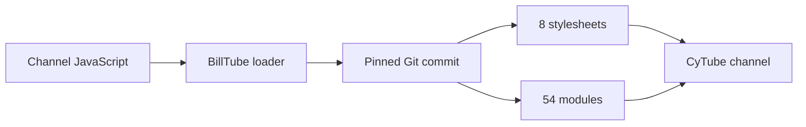

<div align="center">

# BillTube 3

### Version 1 for CyTube channels

BillTube adds player controls, chat tools, movie information, mobile layouts, and a settings panel. It is installed through Channel JavaScript.

<p>
  
  
  
  
</p>

[Install](#installation) · [Features](#features) · [Settings](#channel-theme-toolkit) · [Help](#help-and-feedback)

</div>

---

## About

BillTube is a theme for [CyTube](https://github.com/calzoneman/sync). It changes the channel layout and adds optional tools for video playback, chat, movie information, and channel administration.

It runs from Channel JavaScript, so it does not need a separate website or server. Most settings can be changed from the Channel Theme Toolkit after installation.

## How it loads

The loader resolves the `main` branch to a Git commit before loading BillTube. This keeps the framework, its 54 loaded modules, and its 8 stylesheets on the same revision. If jsDelivr fails, the loader tries a second CDN.



## Features

### Player

- Theater mode, picture-in-picture, fullscreen controls, and Chromecast support
- Audio enhancement with a 2.5× volume boost and dynamic-range compression presets for loudness normalization
- Automatic English subtitle fetching for direct video files through Wyzie or SubDL, with a Stremio addon fallback
- Local subtitle file loading
- Full-width video and touch controls on phones and tablets
- Event countdowns shown in each viewer's local time

### Chat

- Emote picker with channel emotes, animated emoji, recent emotes, and searchable community packs
- Inline emote autocomplete with image previews
- GIF search and favorites
- Avatars, timestamps, mentions, and notification sounds
- Spoilers, text styling, chat colors, ignore controls, and a user-list overlay
- Emote packs from 7TV, BetterTTV, FrankerFaceZ, and emoji.gg

### Movie features

- Now-playing cards with posters, summaries, and ratings
- Movie polls with TMDB information
- A searchable playlist catalogue
- End-of-movie audience ratings and a channel leaderboard
- Movie cards posted by the `!summary` chat command

### Appearance and channel settings

- Color presets and individual color settings
- Typography presets, custom fonts, branding, favicons, and poster overrides
- Patterned backgrounds with previews
- Featured content, custom resources, and optional channel modules
- Configuration backup and restore

## Installation

You need administrator access (rank 3 or higher) on the CyTube channel.

1. Open **Channel Settings → Edit → Channel JavaScript**.
2. Paste the loader below into the editor.
3. Save your changes and reload the channel.
4. Open the new **Theme** section in Channel Settings to configure BillTube.

```js
/* BillTube 3 loader */
(function (window, document) {
  var repository = "BillTube/BillTube3";
  var branch = "main";
  var entrypoint = "billtube-fw.js";

  if (window.BTFW || document.querySelector("script[data-btfw-loader]")) return;

  function inject(source, onError) {
    var script = document.createElement("script");
    script.src = source;
    script.async = false;
    script.dataset.btfwLoader = "1";
    if (onError) script.onerror = onError;
    document.head.appendChild(script);
  }

  function loadFallback() {
    inject(
      "https://rawcdn.githack.com/" + repository + "/" + branch + "/" + entrypoint + "?t=" + Date.now()
    );
  }

  fetch("https://api.github.com/repos/" + repository + "/branches/" + branch, { cache: "no-store" })
    .then(function (response) {
      if (!response.ok) throw new Error("Unable to resolve the current release");
      return response.json();
    })
    .then(function (release) {
      var version = release.commit.sha;
      inject(
        "https://cdn.jsdelivr.net/gh/" + repository + "@" + version + "/" + entrypoint,
        loadFallback
      );
    })
    .catch(function () {
      inject(
        "https://cdn.jsdelivr.net/gh/" + repository + "@" + branch + "/" + entrypoint,
        loadFallback
      );
    });
})(window, document);
```

BillTube checks for updates when the channel loads. The loader does not need to be replaced for each release.

### Chat filters

The Theme Toolkit shows the status of BillTube's chat filters at the top of the dashboard. If an update is available:

1. Open **Theme → Chat Filters**.
2. Select **Import Required BillTube Chat Filters**.
3. Confirm with CyTube's **Import filter list** action.

These filters handle spoilers, text styling, emote-pack tokens, and movie cards in chat.

## Channel Theme Toolkit

The Theme Toolkit is available under **Channel Settings → Theme**. Administrators can change BillTube settings there and preview appearance changes before applying them.

| Section | What you can manage |
| --- | --- |
| **Appearance** | Color presets, individual colors, patterned backgrounds, typography, and branding |
| **Featured content** | Featured channels, additional resources, and optional modules |
| **Event countdown** | A channel-wide event title and start time, localized for every viewer |
| **Integrations** | Movie data, GIF search, subtitles, audio enhancement, and audience ratings |
| **Playlist catalogue** | A public movie list built from the channel playlist |
| **Emote marketplace** | Community emote packs from supported providers |
| **Backup & restore** | Export or import BillTube settings as JSON |

The toolkit updates BillTube's marked configuration blocks. It leaves other Channel JavaScript and Channel CSS in place.

## Optional integrations

Most of BillTube works without an external service. These features need additional configuration:

| Feature | Optional service |
| --- | --- |
| Movie information, polls, catalogue, and summaries | [TMDB API key](https://www.themoviedb.org/settings/api) |
| GIF search | Klipy API key |
| Automatic subtitle fetching | A TMDB API key; Wyzie and SubDL keys are optional because a Stremio addon fallback is included |
| Audience ratings | A compatible ratings endpoint |

> [!IMPORTANT]
> Integration keys saved through the toolkit are stored in the channel's public JavaScript and can be viewed by visitors. Use restricted or free-tier keys that are safe to expose. Never enter a private or privileged credential.

## Chat commands

| Command | Purpose |
| --- | --- |
| `!help` | Show the commands available to you |
| `!now` | Show information about the current video |
| `!summary [title]` | Post a movie summary card |
| `!time` | Show the current channel time |
| `!dice` / `!roll` | Roll the dice |
| `!pick a,b,c` | Pick one item from a list |
| `!ask <question>` | Ask a randomized yes-or-no question |
| `!sm` | Post a random channel emote |
| `!leaderboard` | Show the trivia leaderboard |

Moderators also have access to playlist and playback commands such as `!skip`, `!next`, `!bump`, and `!add <url>` according to their CyTube rank.

## Requirements

- A CyTube channel with administrator access for installation
- A current version of Chrome, Edge, Firefox, or Safari
- JavaScript enabled in the browser

BillTube does not require an account, database, or dedicated server. Optional integrations connect directly to their configured services.

## Help and feedback

To report a problem or suggest a change, [open an issue](https://github.com/BillTube/BillTube3/issues). Include your browser and, when useful, a screenshot or console error.

## Credits

- Background patterns by [Hero Patterns](https://heropatterns.com/) (Steve Schoger, CC BY 4.0)
- Animated emoji by [Noto Emoji](https://googlefonts.github.io/noto-emoji-animation/) (Google, Apache-2.0)
- Icons by [Font Awesome](https://fontawesome.com/)
- Player components by [video.js](https://videojs.com/)
- Motion powered by [anime.js](https://animejs.com/)
- Community emotes from [7TV](https://7tv.app/), [BetterTTV](https://betterttv.com/), [FrankerFaceZ](https://www.frankerfacez.com/), and [emoji.gg](https://emoji.gg/)
- Movie data from [TMDB](https://www.themoviedb.org/)

BillTube uses the TMDB API but is not endorsed or certified by TMDB.

---

<div align="center">

BillTube 3 is the successor to [BillTube 2](https://github.com/BillTube/BillTube2).

</div>
