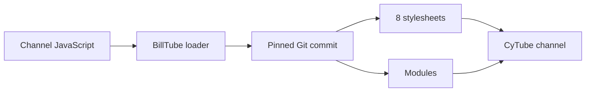

<div align="center">

# BillTube 3

### Version 3 for CyTube channels

BillTube adds player controls, chat tools, movie information, mobile layouts, and a settings panel. It is installed through Channel JavaScript.

<p>
  
  
  
  
</p>

[Install](#installation) · [Features](#features) · [Settings](#channel-theme-toolkit) · [Help](#help-and-feedback)

</div>

---

## About

BillTube is a theme for [CyTube](https://github.com/calzoneman/sync). It changes the channel layout and adds optional tools for video playback, chat, movie information, and channel administration.

It runs from Channel JavaScript, so it does not need a separate website or server. Most settings can be changed from the Channel Theme Toolkit after installation.

## How it loads

The loader resolves the `main` branch to a Git commit before loading BillTube. This keeps the framework, its modules, and its 8 stylesheets on the same revision. If jsDelivr fails, the loader tries a second CDN.


```mermaid
flowchart LR
    A[Channel JavaScript] --> B[BillTube loader]
    B --> C[Pinned Git commit]
    C --> D[8 stylesheets]
    C --> E[Modules]
    D --> F[CyTube channel]
    E --> F
```

## Features

### Player

- Theater mode, picture-in-picture, fullscreen controls, and Chromecast support
- Audio enhancement with a 2.5× volume boost and dynamic-range compression presets for loudness normalization
- Automatic English subtitle fetching for direct video files through Wyzie or SubDL, with a Stremio addon fallback
- Local subtitle file loading
- Full-width video and touch controls on phones and tablets
- Event countdowns shown in each viewer's local time

### Chat

- Emote picker with channel emotes, animated emoji, recent emotes, and searchable community packs
- Inline emote autocomplete with image previews
- GIF search and favorites
- Scrolling up pauses chat follow for 25 seconds after the last upward input; the next message then resumes it. Manually returning to the bottom or clicking **New Messages Below** resumes immediately.
- GIFs and emotes outside a 600 px buffer around the chat viewport are suspended with their layout space preserved, and restored before scrolling into view
- Avatars, timestamps, mentions, and notification sounds
- Spoilers, text styling, chat colors, ignore controls, and a user-list overlay
- Emote packs from 7TV, BetterTTV, FrankerFaceZ, and emoji.gg

### Movie features

- Now-playing cards with posters, summaries, and ratings
- Movie polls with TMDB information
- Random Movie Poll and Auto credits polls open the same settings dialog. Manual polls show candidates and reroll; auto polls save their enabled state, movie count (2–10), voting time (30–900 seconds), and Bustin mode per channel in this browser. Longer auto polls start earlier, with voting shortened if they start late, to preserve a 30-second queue buffer. Both modes offer Bustin mode: the playlist video titled **Bustin** is queued when the poll opens, then its position is rechecked so it plays immediately before the winner. Bustin is reserved as an interlude and excluded from nominations; if it is missing, the winner is queued normally.
- Random movie and automatic credits polls select across every loaded playlist entry below the current movie, with no proximity window or candidate limit. Entries above the current movie are treated as played; duplicate titles or media below it are excluded too. If the current entry is unknown or there are no upcoming candidates, selections stay empty rather than falling back to earlier entries. Polls aim for four different decades where title years are available (including older films), and fill remaining slots with wildcards. The last 20 selections, including unstarted drafts and rerolls, are avoided when possible; exhausted pools reuse the least recently nominated movies. The current movie, previous poll winners, and the last 50 distinct movies played while this browser is connected are excluded. History is stored per channel in this browser and can be viewed or cleared under **Movie history**. Playback history starts when this version is used; playlist order also excludes earlier entries without recorded playback. Rerolls show a loading indicator while selecting. Movie data comes from CyTube's media records, including titles whose release year is attached to a word (such as `Alien1979`). The builder shows playlist, eligible and recent-nomination counts, with an expandable decade breakdown; a small decade pool can repeat sooner to meet the four-decade rule. Incomplete playlists show a loading message instead of silently sampling a subset.
- A searchable playlist catalogue
- End-of-movie audience ratings and a channel leaderboard
- Movie cards posted by the `!summary` chat command

### Appearance and channel settings

- Color presets and individual color settings
- Typography presets, custom fonts, branding, favicons, and poster overrides
- Patterned backgrounds with previews
- Featured content, custom resources, and optional channel modules
- Configuration backup and restore

## Installation

You need administrator access (rank 3 or higher) on the CyTube channel.

1. Open **Channel Settings → Edit → Channel JavaScript**.
2. Paste the loader below into the editor.
3. Save your changes and reload the channel.
4. Open the new **Theme** section in Channel Settings to configure BillTube.

```js
/* BillTube 3 loader */
(function (window, document) {
  var repository = "BillTube/BillTube3";
  var branch = "main";
  var entrypoint = "billtube-fw.js";

  if (window.BTFW || document.querySelector("script[data-btfw-loader]")) return;

  function inject(source, onError) {
    var script = document.createElement("script");
    script.src = source;
    script.async = false;
    script.dataset.btfwLoader = "1";
    if (onError) script.onerror = onError;
    document.head.appendChild(script);
  }

  function loadFallback() {
    inject(
      "https://rawcdn.githack.com/" + repository + "/" + branch + "/" + entrypoint + "?t=" + Date.now()
    );
  }

  fetch("https://api.github.com/repos/" + repository + "/branches/" + branch, { cache: "no-store" })
    .then(function (response) {
      if (!response.ok) throw new Error("Unable to resolve the current release");
      return response.json();
    })
    .then(function (release) {
      var version = release.commit.sha;
      inject(
        "https://cdn.jsdelivr.net/gh/" + repository + "@" + version + "/" + entrypoint,
        loadFallback
      );
    })
    .catch(function () {
      inject(
        "https://cdn.jsdelivr.net/gh/" + repository + "@" + branch + "/" + entrypoint,
        loadFallback
      );
    });
})(window, document);
```

BillTube checks for updates when the channel loads. The loader does not need to be replaced for each release.

### Chat filters

The Theme Toolkit shows the status of BillTube's chat filters at the top of the dashboard. If an update is available:

1. Open **Theme → Chat Filters**.
2. Select **Import Required BillTube Chat Filters**.
3. Confirm with CyTube's **Import filter list** action.

These filters handle spoilers, text styling, emote-pack tokens, and movie cards in chat.

## Channel Theme Toolkit

The Theme Toolkit is available under **Channel Settings → Theme**. Administrators can change BillTube settings there and preview appearance changes before applying them.

| Section | What you can manage |
| --- | --- |
| **Appearance** | Color presets, individual colors, patterned backgrounds, typography, and branding |
| **Featured content** | Featured channels, additional resources, and optional modules |
| **Event countdown** | A channel-wide event title and start time, localized for every viewer |
| **Integrations** | Movie data, GIF search, subtitles, audio enhancement, and audience ratings |
| **Playlist catalogue** | A public movie list built from the channel playlist |
| **Emote marketplace** | Community emote packs from supported providers |
| **Backup & restore** | Export or import BillTube settings as JSON |

The toolkit updates BillTube's marked configuration blocks. It leaves other Channel JavaScript and Channel CSS in place.

## Optional integrations

Most of BillTube works without an external service. These features need additional configuration:

| Feature | Optional service |
| --- | --- |
| Movie information, polls, catalogue, and summaries | [TMDB API key](https://www.themoviedb.org/settings/api) |
| GIF search | Klipy API key |
| Automatic subtitle fetching | A TMDB API key; Wyzie and SubDL keys are optional because a Stremio addon fallback is included |
| Audience ratings | A compatible ratings endpoint |
| Private Drive library search | The BillTube Drive Worker bridge and a per-browser access token |

> [!IMPORTANT]
> Integration keys saved through the toolkit are stored in the channel's public JavaScript and can be viewed by visitors. Use restricted or free-tier keys that are safe to expose. Never enter a private or privileged credential.

The Drive library access token is an exception: it is entered from **Add media → Drive library → Connection** and stored only in that browser's local storage. It is not written to Channel JavaScript. The matching `BTFW_LIBRARY_TOKEN` must be configured as a secret on the Drive Worker.

## Chat commands

| Command | Purpose |
| --- | --- |
| `!help` | Show the commands available to you |
| `!now` | Show information about the current video |
| `!summary [title]` | Post a movie summary card |
| `!time` | Show the current channel time |
| `!dice` / `!roll` | Roll the dice |
| `!pick a,b,c` | Pick one item from a list |
| `!ask <question>` | Ask a randomized yes-or-no question |
| `!sm` | Post a random channel emote |
| `!leaderboard` | Show the trivia leaderboard |

Moderators also have access to playlist and playback commands such as `!skip`, `!next`, `!bump`, and `!add <url>` according to their CyTube rank.

## Requirements

- A CyTube channel with administrator access for installation
- A current version of Chrome, Edge, Firefox, or Safari
- JavaScript enabled in the browser

BillTube does not require an account, database, or dedicated server. Optional integrations connect directly to their configured services.

## Help and feedback

To report a problem or suggest a change, [open an issue](https://github.com/BillTube/BillTube3/issues). Include your browser and, when useful, a screenshot or console error.

## Credits

- Background patterns by [Hero Patterns](https://heropatterns.com/) (Steve Schoger, CC BY 4.0)
- Animated emoji by [Noto Emoji](https://googlefonts.github.io/noto-emoji-animation/) (Google, Apache-2.0)
- Icons by [Font Awesome](https://fontawesome.com/)
- Player components by [video.js](https://videojs.com/)
- Motion powered by [anime.js](https://animejs.com/)
- Community emotes from [7TV](https://7tv.app/), [BetterTTV](https://betterttv.com/), [FrankerFaceZ](https://www.frankerfacez.com/), and [emoji.gg](https://emoji.gg/)
- Movie data from [TMDB](https://www.themoviedb.org/)

BillTube uses the TMDB API but is not endorsed or certified by TMDB.

---

<div align="center">

BillTube 3 is the successor to [BillTube 2](https://github.com/BillTube/BillTube2).

</div>
